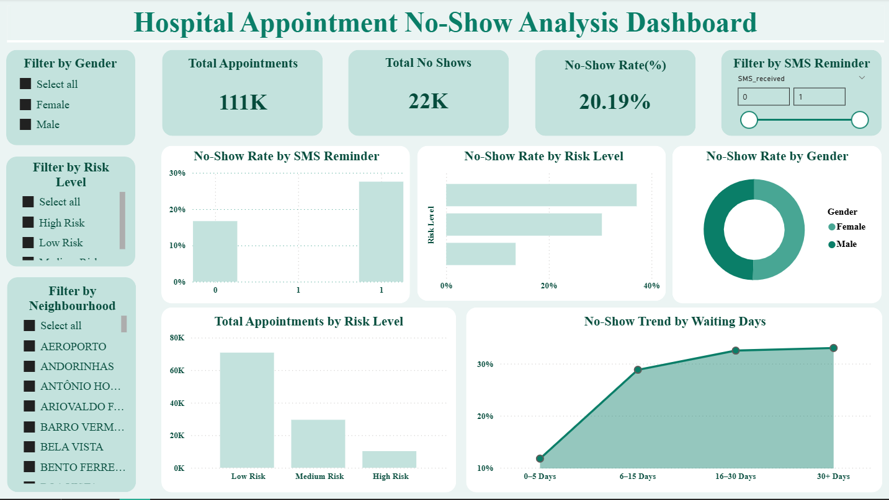

## Healthcare No-Show Prediction
## Overview

This project analyzes hospital appointment no-shows and builds a machine learning model to predict whether a patient will miss an appointment.

The project includes:

## Power BI Dashboard (Data Analysis)

## Decision Tree Prediction Model (Python)

## Feature Importance Visualization

## Dashboard Insights

## The dashboard analyzes:

Total Appointments

Total No-Shows

No-Show Rate (%)

No-Show by Gender

No-Show by Risk Level

No-Show by SMS Reminder

No-Show Trend by Waiting Days

## Dashboard Preview

(Just make sure your image file name is exactly Dashboard_Screenshot.png)

## Machine Learning Model

Model Used: Decision Tree Classifier

Features:

Age

SMS_received

Scholarship

Hipertension

Diabetes

Alcoholism

Handcap

Accuracy: ~63%

## Tools Used

Python

Pandas

Scikit-Learn

Matplotlib

Power BI
